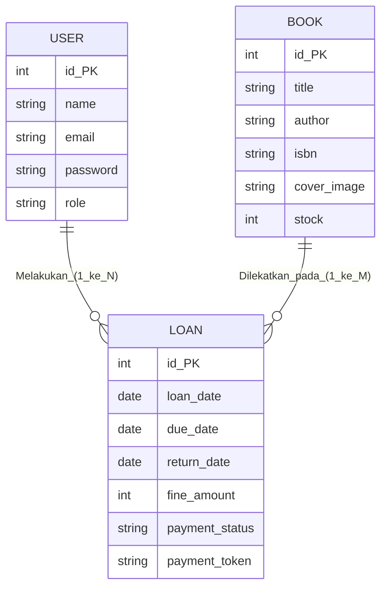

# 📚 Librify - Modern Library Management System

Librify adalah sistem informasi manajemen perpustakaan modern berbasis web yang dibangun menggunakan **CodeIgniter 4**. Aplikasi ini dirancang dengan antarmuka yang ramah pengguna menggunakan layout _Modern Soft UI Bento Grid_ dan dilengkapi dengan berbagai fitur _enterprise-level_ seperti integrasi Payment Gateway Midtrans, konsumsi API eksternal Open Library, dan Notifikasi Email bukti pembayaran otomatis.

Proyek ini dikembangkan untuk memenuhi penugasan mata kuliah Web Development.

## ✨ Fitur Utama (Berdasarkan Aspek Penilaian)

1. **Struktur MVC Murni (Aspek 1, 2, 9):** Menggunakan _Controller_, _Model_, dan _View_ CI4 secara ketat dengan prinsip _Clean Code_.
2. **Autentikasi & Multi-Role (Aspek 3):** Dilengkapi fitur Login dengan Route Filters untuk role **Admin** dan **Member**.
3. **CRUD Buku & Upload (Aspek 4):** Manajemen data buku yang dinamis dengan validasi form bawaan CI4 serta sistem penanganan berkas (_file handling_).
4. **Open Library API Integration (Aspek 5 - Webservice Client 15%):** Konsumsi API eksternal `https://openlibrary.org` menggunakan HTTP Client (cURL Request) internal CI4 pada form tambah buku admin. Dilengkapi **Advanced Error Handling (Try-Catch)** berupa _Fallback Simulator Mode_ dan **Data Caching selama 30 menit** untuk optimasi performa.
5. **RESTful API Server (Aspek 6 - Expose API Endpoint 15%):** Menyediakan _endpoint_ API mandiri (`/api/books`) berstandar RESTful (`ResourceController`) yang menghasilkan respon JSON rapi serta diamankan menggunakan HTTP Header **API Key Filter (`X-Authorization-Key`)**.
6. **Payment Gateway Integration (Aspek 7):** Terintegrasi dengan **Midtrans Snap API** untuk memproses pembayaran denda keterlambatan secara otomatis menggunakan lingkungan _Sandbox_.
7. **Email Notification (Aspek 7):** Pengiriman _e-receipt_ atau setruk bukti pelunasan denda otomatis ke email pengguna menggunakan library SMTP/Mail CI4.
8. **Modern Bento UI/UX (Aspek 8):** Menggunakan layout _Modern Soft UI Bento Grid_ yang bersih, responsif, estetis, dan terstruktur memanfaatkan _templating engine_ (`$this->extend`).

---

## 📊 Entity Relationship Diagram (ERD) - Versi Konseptual (Chen Notation)

Berikut adalah rancangan konseptual hubungan antar entitas pada sistem perpustakaan **Librify** yang disesuaikan dengan model logika Chen Notation menggunakan diagram Mermaid:

