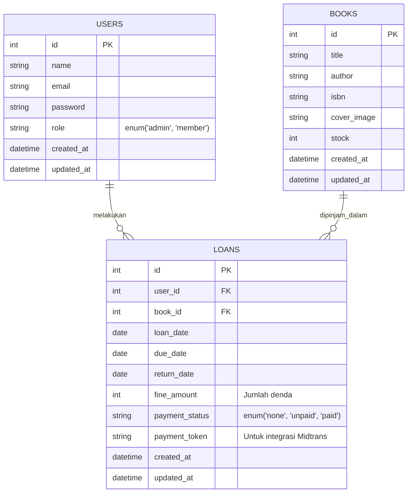

# 📚 Librify - Sistem Manajemen Perpustakaan

Sistem informasi manajemen perpustakaan berbasis **CodeIgniter 4**. Aplikasi ini mendukung fitur peminjaman buku, manajemen denda dengan payment gateway (Midtrans Sandbox), serta integrasi API eksternal. Dibuat untuk memenuhi Tugas Project Pemrograman Web Lanjut.

## 🗂️ Entity Relationship Diagram (ERD)

Sistem ini menggunakan arsitektur database yang telah dinormalisasi hingga bentuk 3NF.



## ⚙️ Cara Instalasi & Konfigurasi `.env`

1. **Clone Repository**

   ```bash
   git clone <URL_REPO_GITHUB_KAMU>
   cd <nama-folder-project>
   ```

2. **Install Dependencies**
   Pastikan Composer sudah terinstall, lalu jalankan:

   ```bash
   composer install
   ```

3. **Konfigurasi Environment**
   - Copy file `env` bawaan CI4 menjadi `.env`:
     ```bash
     cp env .env
     ```
   - Buka file `.env`, hilangkan tanda `#`, dan sesuaikan konfigurasi berikut:

     ```env
     CI_ENVIRONMENT = development

     database.default.hostname = localhost
     database.default.database = nama_database_perpus
     database.default.username = root
     database.default.password =
     database.default.DBDriver = MySQLi
     ```

4. **Jalankan Migration & Seeder**
   Untuk membuat tabel dan mengisi data _dummy_ otomatis, jalankan:

   ```bash
   php spark migrate --seed
   ```

5. **Jalankan Aplikasi**
   ```bash
   php spark serve
   ```
   Akses aplikasi di `http://localhost:8080`.

## 🔐 Akun Demo

| Role       | Email             | Password    |
| :--------- | :---------------- | :---------- |
| **Admin**  | admin@perpus.com  | password123 |
| **Member** | member@perpus.com | password123 |

## 📸 Screenshot Fitur Utama

_Up Coming_

- **Dashboard Admin:** `[Tambahkan link screenshot dashboard admin]`
- **Katalog Buku:** `[Tambahkan link screenshot katalog]`
- **Payment Denda:** `[Tambahkan link screenshot integrasi Midtrans]`

## 👨‍💻 Author

**Nama Mahasiswa**
NIM: A11.2024.12345
Program Studi: Teknik Informatika - Universitas Dian Nuswantoro
